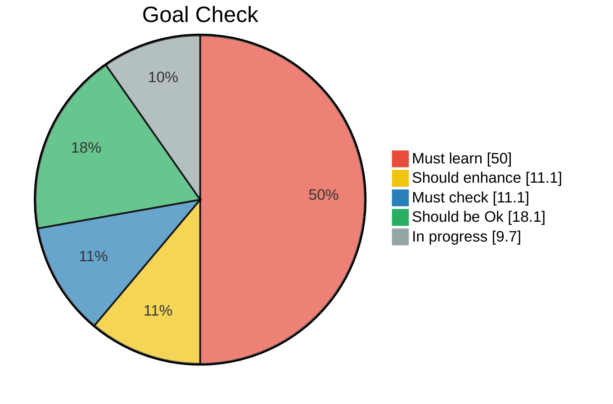

<h1 align="center">Hi 👋, I'm Nad</h1>
<h3 align="center">A self taught</h3>

---------------------
---------------------

[Google doc data source (in French)](https://docs.google.com/spreadsheets/d/1j2XY_vpv0M_gYIrJ4xeTp9vO3Vr90mrW/edit?usp=sharing&ouid=117876886799053011461&rtpof=true&sd=true) taked from [roadmap.sh](https://roadmap.sh/backend) 

##### _(This pie graph is not necessary the last version of the Google document)_